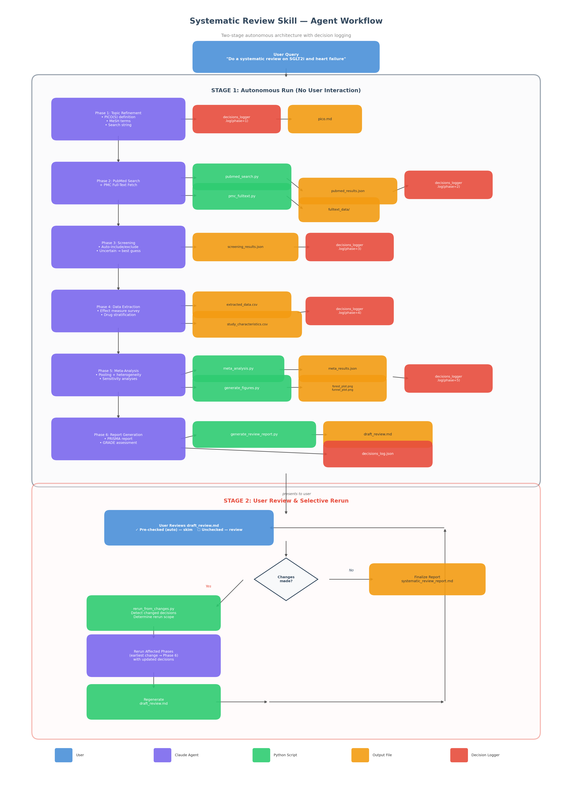

# Systematic Review & Meta-Analysis Skill

A Claude Code skill that conducts PRISMA 2020-compliant systematic reviews and meta-analyses autonomously.

## Workflow



## How It Works

The skill uses a **two-stage architecture**:

1. **Stage 1 (Autonomous):** Claude runs all 6 phases without stopping — topic refinement, PubMed search, screening, data extraction, meta-analysis, and report generation. Every decision is logged with rationale and confidence level.

2. **Stage 2 (Review):** Claude presents a single `draft_review.md` with embedded decision checkpoints. Pre-checked items (✓) are high-confidence decisions; unchecked items (☐) need your attention. You review, override any decisions, and Claude reruns only the affected phases.

## Installation

1. Clone this repo into your Claude Code skills directory:
   ```bash
   git clone https://github.com/chunchiehfan/systematic-review.git ~/.claude/skills/systematic-review
   ```

2. Install Python dependencies:
   ```bash
   pip install matplotlib scipy numpy
   ```

3. The skill is automatically available in Claude Code. Trigger it by asking Claude to perform a systematic review, meta-analysis, or literature synthesis.

## Usage

Just ask Claude naturally. Examples:

- *"Do a systematic review on SGLT2 inhibitors and heart failure hospitalization"*
- *"Run a meta-analysis on whether obesity increases COVID-19 mortality"*
- *"Compare laparoscopic vs open appendectomy — full systematic review with forest plots"*

Claude will:
1. Define PICO and build a PubMed search string
2. Search PubMed and fetch full text from PMC where available
3. Screen articles using confidence tiers (auto-include/auto-exclude/uncertain)
4. Extract data with source tracking and drug stratification (for pharmacological reviews)
5. Run meta-analysis with automatic sensitivity analyses
6. Generate a PRISMA-compliant report with GRADE assessment
7. Present everything for your review in one pass

## Project Structure

```
systematic-review/
├── SKILL.md                          # Skill definition (loaded by Claude Code)
├── scripts/
│   ├── pubmed_search.py              # PubMed API search
│   ├── pmc_fulltext.py               # PMC full-text fetcher + table extraction
│   ├── meta_analysis.py              # DerSimonian-Laird random effects pooling
│   ├── generate_figures.py           # Forest plots, funnel plots, PRISMA diagrams
│   ├── decisions_logger.py           # Decision logging across phases
│   ├── generate_review_report.py     # Draft review with decision checkpoints
│   ├── rerun_from_changes.py         # Change detection and rerun scope
│   └── test_*.py                     # Unit tests for each script
├── references/
│   ├── extraction_templates.md       # CSV templates for data extraction
│   └── statistics_guide.md           # Statistical methods reference
├── evals/
│   └── evals.json                    # Skill evaluation test cases
└── docs/
    └── plans/                        # Implementation plans
```

## Scripts

### `pubmed_search.py`
Search PubMed with a Boolean query string.
```bash
python scripts/pubmed_search.py "(SGLT2[MeSH] OR empagliflozin[tiab]) AND heart failure[MeSH]" \
  --max-results 500 --output pubmed_results.json --api-key YOUR_KEY
```

### `pmc_fulltext.py`
Fetch full-text XML from PubMed Central and extract structured tables.
```bash
python scripts/pmc_fulltext.py pubmed_results.json --output-dir fulltext_data/ --api-key YOUR_KEY
```

### `meta_analysis.py`
Pool effect estimates using DerSimonian-Laird random effects.
```bash
python scripts/meta_analysis.py extracted_data.csv --measure OR --output meta_results.json
```

### `generate_figures.py`
Generate forest plots, funnel plots, and PRISMA flow diagrams.
```bash
python scripts/generate_figures.py meta_results.json \
  --forest forest_plot.png --funnel funnel_plot.png \
  --prisma prisma_data.json --prisma-out prisma_diagram.png
```

### `generate_review_report.py`
Combine the report and decision log into a reviewable draft.
```bash
python scripts/generate_review_report.py \
  --decisions decisions_log.json --report systematic_review_report.md --output draft_review.md
```

### `rerun_from_changes.py`
Detect which decisions changed and determine rerun scope.
```bash
python scripts/rerun_from_changes.py --original decisions_log.json --modified decisions_modified.json
```

## Running Tests

```bash
cd ~/.claude/skills/systematic-review/scripts
python -m unittest discover -v -p "test_*.py"
```

## Output Files

A typical review produces these files in your project directory:

| File | Description |
|------|-------------|
| `pico.md` | PICO question and search strategy |
| `pubmed_results.json` | Raw PubMed search results |
| `fulltext_data/` | PMC full-text extracts (tables + sections) |
| `screening_results.json` | Screening decisions with confidence tiers |
| `prisma_data.json` | PRISMA flow diagram counts |
| `extracted_data.csv` | Quantitative data for meta-analysis |
| `study_characteristics.csv` | Study-level characteristics |
| `meta_results.json` | Pooled effect estimates and heterogeneity |
| `forest_plot.png` | Forest plot |
| `funnel_plot.png` | Funnel plot for publication bias |
| `prisma_diagram.png` | PRISMA 2020 flow diagram |
| `decisions_log.json` | All autonomous decisions with rationale |
| `draft_review.md` | Final report with decision review checkpoints |
